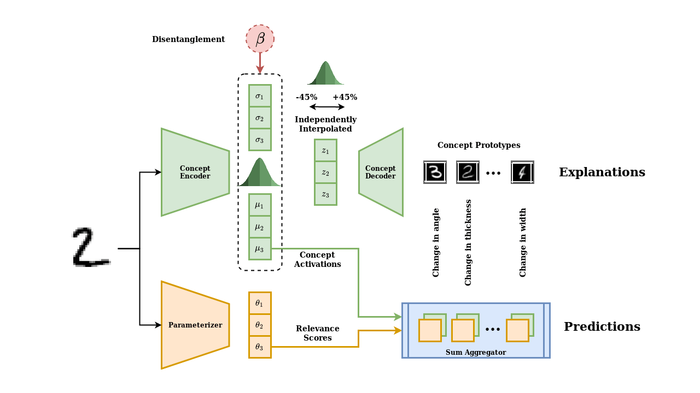

# Self-Explaining Neural Networks: A review with extensions

TODO: Description

## Table of Contents
  - [Self-Explaining Neural Networks: A review with extensions](#self-explaining-neural-networks-a-review-with-extensions)
  - [Table of Contents](#table-of-contents)
  - [Project Structure](#project-structure)
  - [How to run?](#how-to-run)
  - [Results](#results)
  - [Extensions](#extensions)
  - [Documentation](#documentation)
  - [Authors](#authors)
  - [References](#references)

## Project Structure

The project is organized as follows:
1. **models**: classes defining model architecture
2. **configs**: experiment configurations
3. **trainers**: scripts for training
4. **datasets**: scripts for data loading
5. **utils**: utility functions
6. **doc**: API documentation
7. **notebooks**: development notebooks showing some of the APIs
8. **results**: recorded results of experiments
9. **results/checkpoints**: saved model weights
10. *report.ipynb*: notebook reporting final results

## How to run?

## Results

## Extensions

## Documentation

## Authors

* Aman Hussain (aman.hussain@student.uva.nl)  ID: 12667447  
* Omar Elbaghdadi (omarelb@gmail.com)   
* Christoph Hoenes (christoph.hoenes@gmail.com) ID: 128619444   
* Ivan Bardarov (ivan.bardarov@student.uva.nl)  

Supervisor:  
Simon Passenheim

## References
[1] David Alvarez Melis, Tommi S. Jaakkola  
"Towards Robust Interpretability with Self-Explaining Neural Networks" NIPS 2018
[2] Irina Higgins, et al.  
”β-VAE: Learning basic visual concepts with a constrained variational framework.” ICLR 2017. 
