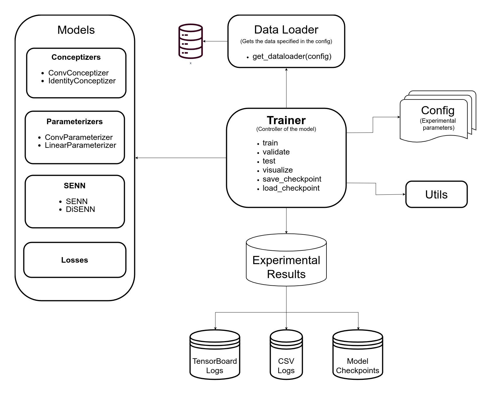

# Self-Explaining Neural Networks: A review with extensions

TODO: Description

## Table of Contents
---
1. [Project Structure](#project-structure)
2. [Results](#results)
3. [How to run](#how-to-run)
4. [Documentation](#documentation)
5. [References](#references)

## Project Structure
---



The project is organized as follows:
1. **configs**: experiment configurations
2. **doc**: API documentation
3. **senn/models**: classes defining model architecture
4. **senn/datasets**: scripts for data loading
5. **senn/utils**: utility functions
6. **senn/trainers**: scripts for training
7. **senn/notebooks**: development notebooks showing some of the APIs
8. **senn/results/checkpoints**: saved model weights
9. *report.ipynb*: notebook reporting final results

## Results
---

## How to run?
---
```
{
  "exp_name": "exp001",                   (str, the name of the experiment, used to save the checkpoints and csv results)
  "data_path": "datasets/data/mnist_data",(str, the path where the data is to be saved)
  "model_class": "SENN"/"DiSENN",         (str, whether to create a SENN or a DiSENN model)
  "pretrain_epochs": 1,                   (int, the number of epochs  to pretrain a beta-VAE for)
  "pre_beta": 1.0,                        (float, the beta to be used in case of DiSENN (VAE pretraining))
  "beta": 4.0,                            (float, the beta to be used in case of DiSENN (DiSENN training))
  "train": true/false,                    (bool, whether to train the model or not)
  "dataloader": "compas"/"mnist",         (str, the name of the dataloader to be used)
  "conceptizer": "Conceptizer",           (str, the name of the conceptizer class to be used)
  "parameterizer": "Parameterizer",       (str, the name of the parameterizer class to be used)
  "aggregator": "Aggregator",             (str, the name of the aggregator class to be used)
  "image_size": 28,                       (int, the size of the input images)
  "num_concepts": 5,                      (int, the number of concepts to be used in training)
  "num_classes": 10,                      (int, the number of output classes)
  "dropout": 0.5,                         (float, the dropout value to be used during training)
  "device": "cuda:0"/"cpu",               (str, which device to be used for the model)
  "lr": 2e-4,                             (float, the learning rate value)
  "epochs": 100,                          (int, the number of epochs)
  "batch_size" : 200,                     (int, the size of each batch of data)
  "print_freq": 100,                      (int, how often to print metrics for the trainint set)
  "eval_freq" : 30,                       (int, how often to evaluate the model and print metrics for the validation set)
  "robustness_loss": "compas_robustness_loss", (str, the name of the robustness loss function from the losses package)
  "robust_reg": 1e-1,                     (float, the robustness regularization value)
  "concept_reg": 1,                       (float, the concept regularization value)
  "sparsity_reg": 2e-5,                   (float, the sparsity regularization value)
  "manual_seed": 42                       (int, the seed to be used for reproducibility)
} **
```
** Note that it is also possible to specify the architectures of the parameterizer and conceptizer classes using *config* parameters. However, to keep it neat, these are not shown here. For more information, please refer to the docstrings of the specific classes and the parameters they can take.


## Documentation
---


## Authors
---
Aman Hussain (aman.hussain@student.uva.nl) ID: 12667447  
Omar Elbaghdadi (omarelb@gmail.com) ID: 12660256  
Christoph Hoenes (christoph.hoenes@gmail.com) ID: 12861944    
Ivan Bardarov (ivan.bardarov@student.uva.nl)  ID: 12579572  

Supervisor:  
Simon Passenheim

## References
---
[1] David Alvarez Melis, Tommi S. Jaakkola  
"Towards Robust Interpretability with Self-Explaining Neural Networks" NIPS 2018  
[2] Irina Higgins, et al.  
”β-VAE: Learning basic visual concepts with a constrained variational framework.” ICLR 2017. 
