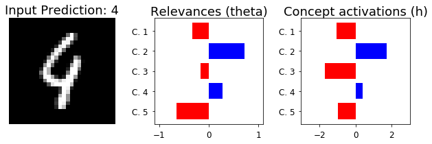
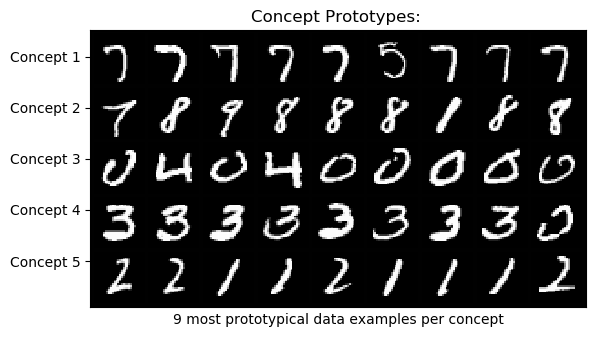

# Self-Explaining Neural Networks: A review with extensions

This repository contains the code for reproducing the paper ``Towards Robust Interpretability with Self-Explaining Neural Networks''[1] and extending it. The authors propose a framework called SENN (Self-Explaining Neural Network) which is transparent by design. We study the reproducibilty and validity of the proposed framework. Several weaknesses of the approach are identified. Most notably, we find that the model rarely generates good explanations, and that performance is compromised more than reported by the authors when enforcing explanations to be stable.  We put forward improvements to the framework that address these weaknesses in a principled way, and show them to enhance the interpretability of generated explanations.

## Table of Contents
  1. [Project Structure](#project-structure)
  2. [How to run?](#how-to-run)
  3. [Results](#results)
  4. [Documentation](#documentation)
  5. [Authors](#authors)
  6. [References](#references)

## Project Structure


## How to run?

1. Clone and activate our conda environment
```
 git clone https://github.com/AmanDaVinci/SENN
 cd senn
 conda env create -f "environment.yml
 conda activate senn
```

2. To reproduce our results using trained models, run the [Report Notebook](report.ipynb).  

3. To train a model using one of our experiment parameters:
```
  python main.py --config "configs/compas_lambda1e-4_seed555.json"
```

4. To train a new model or perform a new experiment:
```
 python main.py --config "./config.json"
```

Where *config.json* is prepared according to the template below:

```
{
  "exp_name": "exp001",                         (str, the name of the experiment, used to save the checkpoints and csv results)
  "data_path": "datasets/data/mnist_data",      (str, the path where the data is to be saved)
  "model_class": "SENN"/"DiSENN",               (str, whether to create a SENN or a DiSENN model)
  "pretrain_epochs": 1,                         (int, the number of epochs  to pretrain a beta-VAE for)
  "pre_beta": 1.0,                              (float, the beta to be used in case of DiSENN (VAE pretraining))
  "beta": 4.0,                                  (float, the beta to be used in case of DiSENN (DiSENN training))
  "train": true/false,                          (bool, whether to train the model or not)
  "dataloader": "compas"/"mnist",               (str, the name of the dataloader to be used)
  "conceptizer": "Conceptizer",                 (str, the name of the conceptizer class to be used)
  "parameterizer": "Parameterizer",             (str, the name of the parameterizer class to be used)
  "aggregator": "Aggregator",                   (str, the name of the aggregator class to be used)
  "image_size": 28,                             (int, the size of the input images)
  "num_concepts": 5,                            (int, the number of concepts to be used in training)
  "num_classes": 10,                            (int, the number of output classes)
  "dropout": 0.5,                               (float, the dropout value to be used during training)
  "device": "cuda:0"/"cpu",                     (str, which device to be used for the model)
  "lr": 2e-4,                                   (float, the learning rate)
  "epochs": 100,                                (int, the number of epochs)
  "batch_size" : 200,                           (int, the size of each batch of data)
  "print_freq": 100,                            (int, how often to print metrics for the trainint set)
  "eval_freq" : 30,                             (int, how often to evaluate the model and print metrics for the validation set)
  "robustness_loss": "compas_robustness_loss",  (str, the name of the robustness loss function from the losses package)
  "robust_reg": 1e-1,                           (float, the robustness regularization hyperparameter)
  "concept_reg": 1,                             (float, the concept regularization hyperparameter)
  "sparsity_reg": 2e-5,                         (float, the sparsity regularization hyperparameter)
  "manual_seed": 42                             (int, the seed to be used for reproducibility)
  "accuracy_vs_lambda": ['c1.json','c2.json']   (list of str or list of lists where the inner lists need to have the same lengths, containing the name of the config files for the accuracy vs lambda plots)
  "num_seeds": 1                                (int, number of seeds used for the accuracy_vs_lambda plot, needs to be equal to the lengths of the inner lists passed in accuracy_vs_lambda, default = 1)
}
```
Note: It is also possible to specify the architectures of the parameterizer and conceptizer classes using *config* parameters. However, to keep it neat, these are not shown here. For more information, please refer to the docstrings of the specific classes and the parameters they can take.


## Results
The [Report Notebook](report.ipynb) reproduces all the results of our experiments. Here we present the major results:
1. Reproduced MNIST Test Accuracy: 98.9%
2. Reproduced COMPAS Test Accuracy: 80.9%
3. SENN Explanations: 
4. SENN Prototypes: 

## Documentation
The documentation of our SENN package is available on https://senn.readthedocs.io/en/latest/

## Authors
* Aman Hussain (aman.hussain@student.uva.nl) ID: 12667447  
* Omar Elbaghdadi (omarelb@gmail.com) ID: 12660256  
* Christoph Hoenes (christoph.hoenes@gmail.com) ID: 12861944    
* Ivan Bardarov (ivan.bardarov@student.uva.nl)  ID: 12579572  

**Supervisor:**  
Simon Passenheim

## References
[1] David Alvarez Melis, Tommi S. Jaakkola  
"Towards Robust Interpretability with Self-Explaining Neural Networks" NIPS 2018  
[2] Irina Higgins, et al.  
”β-VAE: Learning basic visual concepts with a constrained variational framework.” ICLR 2017. 
